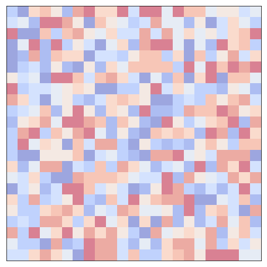

# GREAD: Graph Neural Reaction-Diffusion Networks
 
 [](https://arxiv.org/abs/2211.14208) [](https://hits.seeyoufarm.com)

## Introduction
- Please see our paper for more details: [GREAD: Graph Neural Reaction-Diffusion Networks](https://arxiv.org/abs/2211.14208)
- We will update more information of the code soon.

Reaction-diffusion on a grid graph |  Diffusion on a grid network
:-------------------------:|:-------------------------:
 | 

> An illustrative comparison between the diffusion equation and our proposed blurring-sharpening (reaction-diffusion) equation on a grid graph with one-dimensional node features. The diffusion equation causes the problem of oversmoothing while the reaction-diffusion seeks a balance between smoothing and sharpening. The diffusion equation is a special case of the reaction-diffusion equation when the sharpening term is zero.


---

## Set environment
The environment can be set up using either `environment.yml` file or manually installing the dependencies.
### Using an environment.yml file
```
conda env create -f environment.yml
```
### Manually install
```
conda create -n gread python=3.9
conda activate gread
pip install torch==1.11.0+cu113 --extra-index-url https://download.pytorch.org/whl/cu113
pip install torch-scatter torch-sparse torch-geometric -f https://data.pyg.org/whl/torch-1.11.0+cu113.html
pip install torchdiffeq ogb wandb deeprobust==0.2.4
```

## Dataset and pre-processing
All data gets downloaded and preprocessed automatically and stored in `data` directory (which gets automatically created the first time one of the experiments is run).

## How to run
To run each experiment, navigate into `src`. Then, run the following command:
```
python run_GNN.py --kwargs
```
where `kwargs` are specified in each individual `run_GNN.py` file.

You can also run the best hyperparameters for each dataset by adding `--use_best_params` flag. For example, to run the best hyperparameters for Squirrel dataset, run the following command:
```
python run_GNN.py --dataset=Squirrel --use_best_params
```
---

## Citation

If you find this repository useful in your research, please cite our paper:
```
@inproceedings{choi2023gread,
  title={GREAD: Graph Neural Reaction-Diffusion Networks},
  author={Choi, Jeongwhan and Hong, Seoyoung and Park, Noseong and Cho, Sung-Bae},
  booktitle={ICML},
  year={2023}
}
```